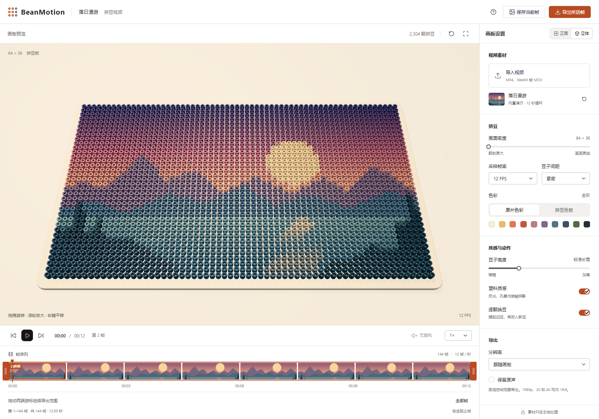
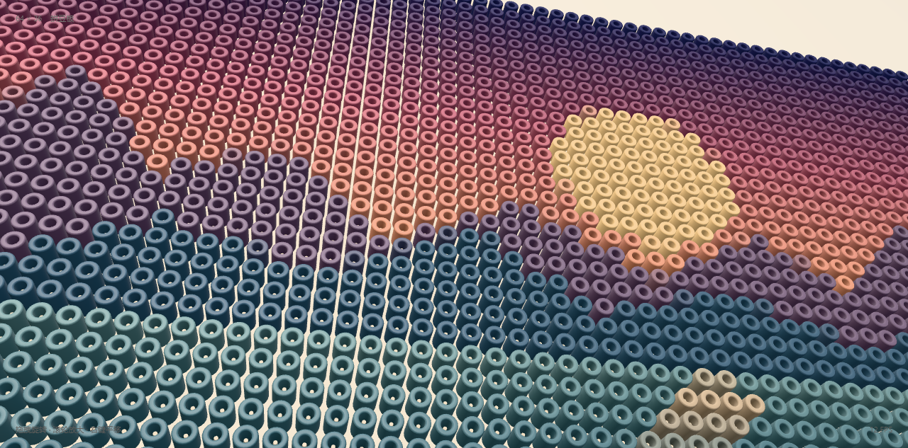

# BeanMotion

把视频变成会动的立体拼豆。在浏览器里调整颗粒、色彩与视角，导出属于你的拼豆动画，素材全程留在本地。

[](https://react.dev/)
[](https://threejs.org/)
[](https://vite.dev/)
[](https://www.w3.org/TR/webcodecs/)

## 界面预览

内置「落日漫游」演示：立体画板、播放时间轴与拼豆设置。



<details>
<summary>查看拼豆细节</summary>

中空豆孔、圆润口沿与塑料光泽，近距离查看立体拼豆的质感。



</details>

## 功能

- **视频变拼豆**：导入本地视频，或直接体验 12 秒落日演示；支持播放、逐帧、倍速与循环。
- **自由调色与造型**：64×36–160×90 密度、6 / 12 / 24 / 30 FPS 采样，调整间距、高度、塑料质感，切换原片色彩或 32 色色板。
- **立体预览**：正面 / 立体视角、旋转缩放与全屏，支持逐颗提起、替换、落回的换豆动画。
- **图片与视频导出**：保存 PNG，拖动游标选择帧范围，逐帧编码 MP4 / WebM；可保留原声，最高支持 4K，支持取消。
- **本地处理**：视频解码、渲染与导出均在浏览器完成，素材不上传服务器；界面适配桌面与小屏。

## 快速开始

使用 Node.js 20.19+ 或 22.12+。

```sh
npm install
npm run dev
```

打开终端显示的本地地址即可体验。生产构建使用 `npm run build`，预览构建使用 `npm run preview`。

## 使用说明

- 推荐使用 Chrome / Edge 并开启硬件加速。可导入的视频格式取决于浏览器解码器，MOV 建议使用 H.264 编码。
- 视频导出需要 WebCodecs，优先使用 H.264 / AAC MP4，不可用时尝试 VP9 / Opus 或 VP8 / Opus WebM。导出采用逐帧编码，不依赖录屏。
- 默认导出全部帧，也可选择片段；起止帧均包含在内。预览静音不影响导出原声，可在导出设置中独立关闭。
- 分辨率可跟随画板（最大 1920×1080），或选择固定 16:9 的 1080p、2K、4K。导出文件暂存在内存中，长视频建议分段处理。

## 开发

基于 React、[Appica UI](https://appica.dev/ui)、Three.js 与 Mediabunny。视频经 Canvas 采样后驱动 InstancedMesh 拼豆阵列，渲染循环独立于 React。

<details>
<summary>验证命令</summary>

几何、动画与帧范围：

```sh
node --test scripts/beads.test.mjs scripts/frame-range.test.mjs
```

浏览器验证（先启动开发服务，需要本机安装 Chrome）：

```sh
node scripts/smoke.mjs
node scripts/export.test.mjs
node scripts/export-resolution.test.mjs
node scripts/export-overlay.test.mjs
```

</details>

## 许可证

本项目采用 [MIT 许可证](LICENSE)，Copyright © 2026 Jasonjin。
